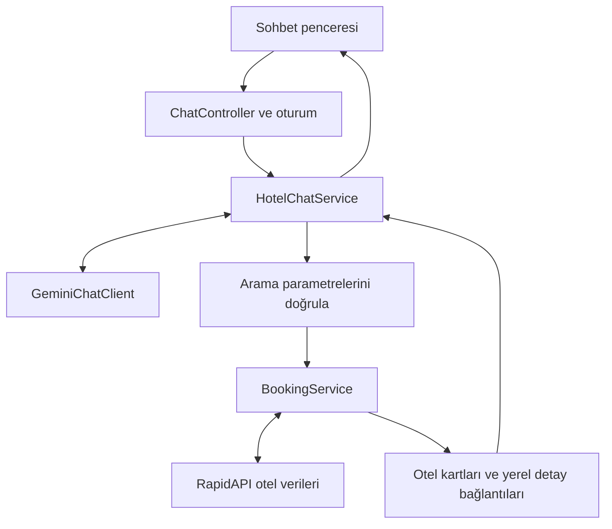

# Stayora

**Gerçek otel verileri ve AI destekli seyahat asistanıyla otel keşfi.**

Stayora, kullanıcıların şehir, tarih, kişi sayısı ve bütçe üzerinden otel arayabildiği bir **ASP.NET Core MVC / .NET 10 case projesidir**. Otel verileri RapidAPI üzerindeki DataCrawler Booking API’den alınır. Gemini destekli asistan, doğal dilde yazılan seyahat planlarını uygulamanın mevcut arama servisine bağlar.

Kullanıcı oteli Stayora’da inceler; rezervasyonunu tamamlamak isterse tarih, yetişkin ve oda bilgileriyle Booking.com’daki otel sayfasına geçer. Uygulama içinde rezervasyon kaydı veya ödeme işlemi oluşturulmaz.

[Kurulum](#kurulum) · [AI asistanı](#ai-asistanı) · [Teknik yapı](#teknik-yapı) · [Mevcut sınırlar](#mevcut-sınırlar)

## Özellikler

### Otel arama ve keşif

- Şehir, giriş–çıkış tarihi, yetişkin ve oda sayısıyla arama.
- Fiyat aralığı ve API üzerinden sıralama.
- Get Filter cevabından oluşturulan yıldız, değerlendirme puanı, olanak, yemek, iptal ve konaklama türü grupları.
- Aynı anda bir kategori filtresinin fiyat aralığı ve sıralamayla birlikte kullanılması.
- Sayfa başına dört otel; sayfalama ve detaydan dönüşte arama kriterlerinin korunması.
- Otel kartlarında fotoğraf, puan, yorum sayısı, fiyat, ek ücretler ve fiyat koşulları.
- TRY para biriminde arama ve detay istekleri; arayüzde TL gösterimi.
- Şehir kısayolları, mobil menü ve form gönderiminde yüklenme durumu.

### Otel detayları

- Adres, konum, olanaklar ve oda açıklamaları.
- Oda fotoğraflarından oluşturulan, büyük açılabilen galeri.
- Koordinatlarla Google Maps’e geçiş.
- API’nin sağladığı toplam fiyat ve müsaitlik bilgisi.
- Seçilen arama bilgileriyle Booking.com’a yönlendirme.

### Sohbet deneyimi

- Her sayfadan açılabilen Stayora AI penceresi.
- Eksik seyahat bilgilerini netleştirmeye yönelik konuşma akışı.
- “Daha ucuzdan sırala” gibi takip mesajlarında önceki kriterlerden yararlanma.
- Gerçek API sonuçlarından oluşturulan fotoğraflı otel kartları.
- Kullanıcıyı seçilen parametrelerle **Stayora’nın detay sayfasına** götüren bağlantılar.
- Yeni sohbet, oturum bazlı istek limiti ve sağlayıcı hata mesajları.

## AI asistanı

Gemini, otel veritabanı olarak kullanılmaz. Model, `search_hotels` fonksiyonuna ait parametreleri üretir; C# tarafı bu parametreleri doğrular ve gerçek aramayı gerçekleştirir. Otel kartları ve detay bağlantıları uygulama koduyla oluşturulur.



1. Kullanıcı mesajı, sunucuda tutulan konuşma geçmişiyle Gemini’ye gönderilir.
2. Model metin yanıtı veya `search_hotels` çağrısı döndürür.
3. Fonksiyon parametreleri `HotelSearchRequest` doğrulamalarından geçirilir.
4. `BookingService` destinasyonu bulur ve filtrelenmiş otel sonuçlarını getirir.
5. `LinkGenerator`, `Hotels/Details` bağlantılarını arama parametreleriyle üretir.
6. Araç sonucu Gemini’ye iletilir; ikinci çağrıda yeni fonksiyon çağrısı kapatılarak kısa açıklama alınır.
7. Açıklama ve otel kartları tarayıcıya birlikte döner.

Örnek konuşma:

> **Kullanıcı:** Berlin’e gitmek istiyorum.  
> **Asistan:** Giriş–çıkış tarihleri, yetişkin ve oda sayısı nedir?  
> **Kullanıcı:** 15–18 Ekim 2027, 2 yetişkin, 1 oda.  
> **Kullanıcı:** En ucuzdan sırala.

Örnek tarihler kullanım sırasında gelecekte olmalıdır. Sohbette tarih ve sayıları netleştirme davranışı model talimatlarıyla yönlendirilir; fonksiyon argümanlarının biçim ve aralık kontrolleri sunucuda uygulanır.

## Teknik yapı

Tek bir web projesi içinde controller, servis, DTO, görünüm modeli ve ViewComponent sorumlulukları ayrılmıştır. Bu sürümde veritabanı, ORM veya kullanıcı hesabı altyapısı bulunmaz.

| Teknoloji | Kullanım |
|---|---|
| .NET 10, C#, ASP.NET Core MVC | Web uygulaması ve controller akışları |
| Razor, ViewComponents | Layout ve tekrar kullanılabilir arayüz bölümleri |
| HttpClientFactory | Booking için typed client, Gemini için named client |
| System.Text.Json | API cevapları ve Gemini fonksiyon mesajları |
| DataAnnotations, IValidatableObject | Alan, tarih ve fiyat aralığı doğrulamaları |
| IMemoryCache | API sonuçları ve sohbet geçmişi |
| ASP.NET Core Session | Sunucuda konuşma kimliği takibi |
| Rate Limiting, Antiforgery | Sohbet gönderim limiti ve POST doğrulaması |
| Google Gemini REST API | Doğal dil ve function calling |
| Sona, Bootstrap, jQuery | Arayüz temeli |
| Magnific Popup, Owl Carousel, SlickNav | Fotoğraf galerisi, slider ve mobil menü |
| JavaScript Fetch API, sessionStorage | Sohbet istekleri ve aynı sekmede görünümün korunması |

### Kaynak kod haritası

| Dizin / dosya | Sorumluluk |
|---|---|
| [Controllers](Controllers) | Arama, detay, sohbet ve Gemini tanılama endpointleri |
| [DTOs/Booking](DTOs/Booking) | Harici otel API’sinin cevap modelleri |
| [Models](Models) | Arama doğrulamaları ve ekran modelleri |
| [Models/Chat](Models/Chat) | Sohbet mesajı, kriter ve otel kartı modelleri |
| [Services/BookingService.cs](Services/BookingService.cs) | Otel API’si, önbellek ve sayfalama |
| [Services/Chat](Services/Chat) | Gemini istemcisi, araç tanımı ve sohbet yönetimi |
| [ViewComponents](ViewComponents) | Sayfa ve layout bileşenleri |
| [Views/Shared/Components](Views/Shared/Components) | Bileşen görünümleri |
| [wwwroot/js](wwwroot/js) | Sohbet, galeri, gezinme ve form davranışları |
| [wwwroot/css/stayora.css](wwwroot/css/stayora.css) | Stayora’ya ait stiller |
| [Program.cs](Program.cs) | DI, HttpClient, session ve middleware yapılandırması |

## Kurulum

### Gereksinimler

- [.NET 10 SDK](https://dotnet.microsoft.com/download/dotnet/10.0).
- [DataCrawler Booking API](https://rapidapi.com/DataCrawler/api/booking-com15) için erişim sağlayan RapidAPI aboneliği ve anahtarı.
- [Google AI Studio](https://aistudio.google.com/apikey) üzerinden Gemini API anahtarı ve seçilen model için kullanılabilir kota.
- İsteğe bağlı: .NET 10 destekleyen Visual Studio veya başka bir editör.

Veritabanı kurulumu ya da migration çalıştırılması gerekmez.

### Projeyi indir

```bash
git clone https://github.com/ismailbarankarasu/Stayora.git
cd Stayora
dotnet restore
```

### Anahtarları tanımla

Proje dosyasında `UserSecretsId` bulunduğu için proje dizininde:

```bash
dotnet user-secrets set "BookingApi:ApiKey" "YOUR_RAPIDAPI_KEY"
dotnet user-secrets set "GeminiApi:ApiKey" "YOUR_GEMINI_KEY"
```

Visual Studio’da **projeye sağ tık → Manage User Secrets** üzerinden de aynı ayarlar eklenebilir. Gerçek anahtarları kaynak koda veya README’ye yazmayın.

[appsettings.json](appsettings.json) içindeki mevcut model:

```json
{
  "GeminiApi": {
    "Model": "gemini-3.5-flash"
  }
}
```

Model değeri `models/` öneki olmadan yazılır. Kullanılabilir modeller ve kotalar sağlayıcıya/projeye bağlıdır; model listesinin dönmesi tek başına metin üretme kotasını doğrulamaz.

Development dışında gizli ayarlar için ortam değişkenleri kullanılabilir:

| Ortam değişkeni | Yapılandırma anahtarı |
|---|---|
| `BookingApi__ApiKey` | `BookingApi:ApiKey` |
| `GeminiApi__ApiKey` | `GeminiApi:ApiKey` |
| `GeminiApi__Model` | `GeminiApi:Model` |

### Çalıştır

```bash
dotnet build
dotnet dev-certs https --trust
dotnet run --launch-profile https
```

HTTPS geliştirme sertifikasının güvenilir olarak tanımlanması işletim sistemine göre ek adım gerektirebilir. Repodaki HTTPS profili uygulamayı [https://localhost:7282](https://localhost:7282) adresinde açar.

## Entegrasyonlar ve endpointler

### Kullanılan harici çağrılar

| Sağlayıcı | Endpoint | Amaç |
|---|---|---|
| Booking API | `GET /api/v1/hotels/searchDestination` | Şehir destinasyonunu bulma |
| Booking API | `GET /api/v1/hotels/searchHotels` | Filtreli ve sıralı otel arama |
| Booking API | `GET /api/v1/hotels/getHotelDetails` | Detay, oda bilgisi ve fotoğraflar |
| Booking API | `GET /api/v1/hotels/getFilter` | Aramaya uygun kategori seçenekleri |
| Gemini | `POST /v1beta/models/{model}:generateContent` | Metin ve fonksiyon çağrısı üretimi |
| Gemini | `GET /v1beta/models` | Geliştirme sırasında model tanılaması |

Galeri, detay cevabındaki oda fotoğraflarını kullanır; ayrı bir fotoğraf API çağrısı yapılmaz.

### Uygulama rotaları

| Metot | Rota | Amaç |
|---|---|---|
| GET | `/` | Ana sayfa |
| GET | `/Hotels/Search` | Arama sonuçları |
| GET | `/Hotels/Details` | Otel detayı |
| GET | `/Chat` | Sade sohbet test sayfası |
| GET | `/Chat/Bootstrap` | Oturum ve antiforgery token hazırlığı |
| POST | `/Chat/Send` | Mesaj gönderimi |
| POST | `/Chat/New` | Yeni konuşma |
| GET | `/GeminiDiagnostics/Models` | Model listesi; yalnızca Development |
| GET / POST | `/GeminiDiagnostics/Test`, `/GeminiDiagnostics/TestReply` | Yanıt üretme testi; yalnızca Development |

## Önbellek ve çalışma sınırları

| Ayar | Mevcut değer |
|---|---|
| Destinasyon önbelleği | 1 saat |
| Otel arama ve filtre önbelleği | 2 dakika |
| Otel detay önbelleği | Yok; detay yeniden istenir |
| API sayfa boyutu varsayımı | 20 otel |
| Arayüz sayfa boyutu | 4 otel |
| Booking HTTP zaman aşımı | 30 saniye / istek |
| Gemini HTTP zaman aşımı | 60 saniye / istek |
| Sohbet geçmişi | 30 dakika kayan süre |
| Sohbet mesaj sınırı | Konuşma başına 20 başarılı kullanıcı mesajı |
| Mesaj uzunluğu | En fazla 2000 karakter |
| Chat/Send limiti | Session başına dakikada 6 istek |

Arama önbellek anahtarı, API URL’sini ve parametrelerini içerir. Fiyat, kategori, sıralama veya tarih değiştiğinde ayrı sonuç saklanır. API’nin 20’lik cevabı değiştirilmeden dört otellik görünüm dilimleri üretilir.

Sohbet geçmişi sunucu belleğinde, ekrandaki son 40 mesaj kaydı aynı sekmenin `sessionStorage` alanında tutulur. Tarayıcı görünümünün korunması sunucu geçmişinin kalıcı olduğu anlamına gelmez. Yeni Sohbet yeni kimlik oluşturur; eski sunucu kaydı süre dolunca temizlenir.

## Doğrulama ve hata yönetimi

- Arama tarihleri, yetişkin/oda sınırları, sıralama ve fiyat aralığı sunucuda doğrulanır.
- Sohbet fonksiyon çağrıları da aynı arama doğrulamalarından geçirilir.
- Sohbet POST işlemlerinde antiforgery doğrulaması bulunur.
- Konuşma kimliği gönderilen mesajdan değil session’dan okunur.
- Aynı konuşmanın mesajları `SemaphoreSlim` ile sırayla işlenir.
- Sohbet metinleri tarayıcıya `textContent` ile yazılır.
- Sohbet kartlarındaki detay bağlantıları aynı origin ile sınırlandırılır.
- Booking yönlendirmesi HTTPS ve Booking.com otel yolu kontrollerinden geçer.
- Filtre servisi başarısız olsa da alınmış otel sonuçları gösterilir.
- Harici servis hataları, boş arama sonucundan ayrı ele alınır.

## Mevcut sınırlar

- Aynı anda tek kategori filtresi desteklenir. Çocuklu arama desteklenmez; yetişkin aralığı 1–8, oda aralığı 1–4’tür.
- Destinasyon aramasının ilk iki sonucundan `city` türündeki ilk kayıt seçilir.
- Fiyat filtresinin gecelik/toplam bazının sağlayıcı tarafındaki anlamı doğrulanmamıştır. Kesin bütçe uyumu vaadi verilmez.
- Liste ve detay TRY ister. **Booking.com yönlendirmesindeki `selected_currency` mevcut kodda AED kalmıştır**; para birimi tutarlılığı için [BuildReservationUrl](Controllers/HotelsController.cs) içindeki değer TRY olarak güncellenmelidir.
- Otel aramasında `languagecode=en-us` ve `location=US` sabittir; Türkçe arayüz tüm API metinlerinin Türkçe olduğu anlamına gelmez.
- Tam 20 kayıt dönen son API sayfasında Sonraki açık kalabilir; takip eden boş sayfada geri dönüş gösterilir.
- Modelin açıklamaları üretkendir; kart verileri ve bağlantılar ise API cevabı ve uygulama kodundan oluşturulur.
- Bellek tabanlı önbellek/session tek uygulama sürecine yöneliktir. Yeniden başlatmada geçmiş kaybolur. Session başına limit, sağlayıcının toplam kotasını garanti etmez.
- Repoda otomatik test projesi veya CI iş akışı bulunmuyor.

## Manuel doğrulama

Kurulumdan sonra aşağıdaki akışlar kontrol edilebilir:

- [ ] Gelecekteki tarihlerle otel arama ve dört kayıtlık sayfalama.
- [ ] Kategori, fiyat ve sıralamanın detaydan dönüşte korunması.
- [ ] Geçersiz tarih/fiyat girişleri ve boş şehir sonucu.
- [ ] Detay galerisi, harita bağlantısı ve Booking.com’da tarih/kişi bilgilerinin kontrolü.
- [ ] AI’nin eksik bilgileri sorması ve gerçek otel kartları üretmesi.
- [ ] Takip mesajında kriterlerin korunması ve Yeni Sohbet ile sıfırlanması.
- [ ] Mobil menü, sohbet penceresi ve servis hata mesajları.

## Geliştirici ve kaynaklar

**İsmail Baran KARASU**  
[GitHub](https://github.com/ismailbarankarasu) · [LinkedIn](https://www.linkedin.com/in/ismail-baran-karasu/)

Arayüz, [Colorlib Sona](https://colorlib.com/wp/template/sona/) teması üzerine uyarlanmıştır. Tema atfı footer’da korunur. Üçüncü taraf tema ve varlıklar kendi lisans koşullarına tabidir; repoda ayrıca bir uygulama `LICENSE` dosyası bulunmamaktadır.

Stayora bağımsız bir eğitim/case çalışmasıdır.
